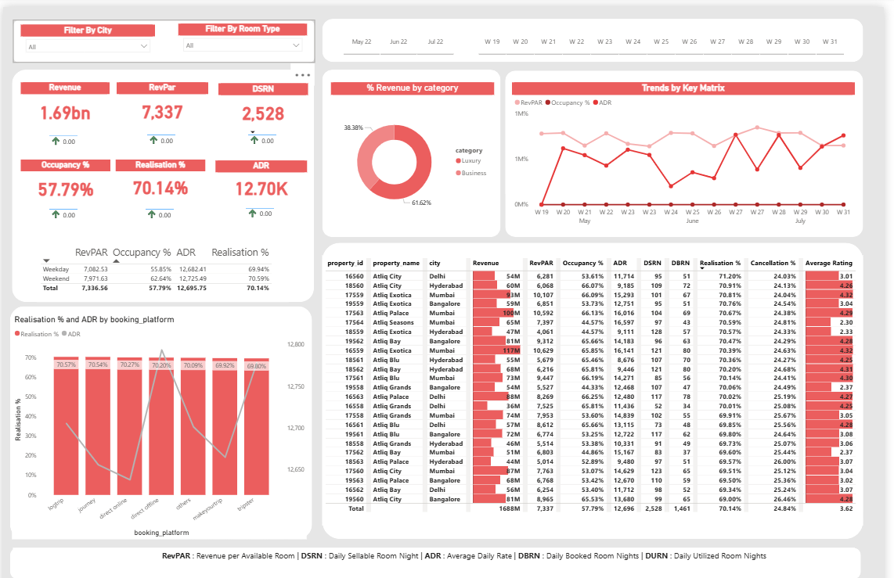

# Hospitality_Revenue_Dashboard

---

### 📊 Overview
An **interactive Power BI dashboard** designed to analyze and visualize **hotel performance metrics** across cities, room types, and booking platforms.  
It helps hotel management track **Revenue, Occupancy %, ADR, RevPAR**, and **Realisation %** to make smarter business decisions.

---

### 🎯 Project Objective
To provide **data-driven insights** into hotel performance by identifying:
- Top-performing cities, room types, and booking platforms  
- Trends in revenue, occupancy, and ADR over time  
- Realisation % and cancellation impact on profitability  
- Key areas for operational improvement  

---

### 📈 Key Metrics (KPIs)
| KPI | Description |
|------|-------------|
| **Revenue** | Total income generated |
| **RevPAR** | Revenue per Available Room |
| **DSRN** | Daily Sellable Room Nights |
| **Occupancy %** | % of rooms occupied |
| **ADR** | Average Daily Rate |
| **Realisation %** | Actual vs potential revenue |
| **Cancellation %** | Booking cancellation ratio |
| **Average Rating** | Guest satisfaction score |

---

### 💻 Dashboard Features
✅ City-wise and Room-type filters  
✅ KPI cards for instant performance overview  
✅ Time-based trend line (May–July performance)  
✅ Revenue by category: Luxury vs Business  
✅ Realisation % and ADR by booking platform  
✅ Property-level performance comparison with color-coded KPIs  

---

### 🛠️ Tools & Technologies Used
- **Power BI Desktop** → Dashboard creation & visualization  
- **DAX (Data Analysis Expressions)** → Calculated measures and KPIs  
- **Power Query** → Data transformation and relationships  
- **Excel / SQL** → Data cleaning and preprocessing  

---

### 📂 Dataset Information
Includes anonymized hotel operational data:
- Property ID, Property Name, City  
- Revenue, DSRN, DBRN, ADR  
- Occupancy %, Realisation %, Cancellation %, Average Rating  

> ⚠️ Dataset used purely for demonstration and learning purposes.

---

### 💡 Key Insights
🔸 **Luxury segment** contributes **61.6%** of total revenue  
🔸 **Bangalore & Mumbai** drive the highest ADR and RevPAR  
🔸 **Weekend performance** exceeds weekday occupancy and realization  
🔸 **Direct online channels** yield the strongest realization %  
🔸 **Customer ratings** moderately influence revenue and ADR  

---

### 🚀 Future Scope
- Integrate with **SQL Database** for live hotel data updates  
- Build **forecasting model** (Python Time Series) for revenue prediction  
- Add **Power BI Drill-through** for deeper property-level analytics  

---

### 🧑‍💻 Author
**Yadhunandan C**  
🎓 B.E. in Information Science | 💼 Aspiring Data Analyst & Power BI Developer  
📍 Tumkur, Karnataka, India  

📫 **Connect With Me**  
  
  

---

